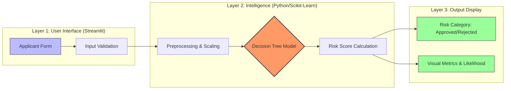

# Credit Risk Prediction Using Decision Tree Classification

**GenAI Capstone Project — NST Sonipat**

---

## 1. Problem Statement

Access to credit is a fundamental enabler of economic participation, yet lending institutions face the persistent challenge of distinguishing creditworthy borrowers from those likely to default. Inaccurate risk assessments lead to significant financial losses through non-performing assets or, conversely, the denial of credit to deserving applicants.

This project addresses the **binary classification problem of predicting loan default risk**. Given a set of applicant and loan attributes — such as income, employment history, loan grade, and prior default records — the goal is to build a supervised machine learning model that can predict whether a borrower will default on a loan (`loan_status = 1`) or repay successfully (`loan_status = 0`).

The trained model is deployed as an interactive **Streamlit web application** that enables real-time credit risk evaluation for new applicants.

---

## 2. Data Description

### 2.1 Source

The dataset is a publicly available credit risk dataset hosted on GitHub, containing **32,581 records** of historical loan applications.

**Source URL:** `https://raw.githubusercontent.com/PALAK7890/GenAI_Capstone/refs/heads/main/credit_risk_dataset.csv`

### 2.2 Features

| Feature                      | Type                  | Description                                                                                 |
| ---------------------------- | --------------------- | ------------------------------------------------------------------------------------------- |
| `person_age`                 | Numerical             | Age of the applicant                                                                        |
| `person_income`              | Numerical             | Annual income of the applicant                                                              |
| `person_emp_length`          | Numerical             | Employment length in years                                                                  |
| `person_home_ownership`      | Categorical           | Home ownership status (RENT, OWN, MORTGAGE, OTHER)                                          |
| `loan_intent`                | Categorical           | Purpose of loan (PERSONAL, EDUCATION, MEDICAL, VENTURE, HOMEIMPROVEMENT, DEBTCONSOLIDATION) |
| `loan_grade`                 | Categorical (Ordinal) | Credit grade assigned to the loan (A–G)                                                     |
| `loan_amnt`                  | Numerical             | Loan amount requested                                                                       |
| `loan_int_rate`              | Numerical             | Interest rate on the loan                                                                   |
| `loan_percent_income`        | Numerical             | Loan amount as a percentage of annual income                                                |
| `cb_person_default_on_file`  | Binary                | Whether the applicant has a previous default on record (Y/N)                                |
| `cb_person_cred_hist_length` | Numerical             | Length of credit history in years                                                           |
| **`loan_status`**            | **Binary (Target)**   | **0 = Non-Default, 1 = Default**                                                            |

### 2.3 Class Distribution

The dataset exhibits **class imbalance**:

- **Non-Default (0):** ~78% of records
- **Default (1):** ~22% of records

### 2.4 Missing Values

| Feature             | Missing Count                 |
| ------------------- | ----------------------------- |
| `person_emp_length` | Present (imputed with median) |
| `loan_int_rate`     | Present (imputed with median) |

---

## 3. Exploratory Data Analysis (EDA)

### 3.1 Target Distribution

A count plot of `loan_status` confirmed the class imbalance, with non-default cases significantly outnumbering defaults. This imbalance was later addressed using `class_weight='balanced'` in the model.

### 3.2 Numerical Feature Analysis

- **Income vs. Default:** Box plots revealed that defaulters tend to have lower incomes compared to non-defaulters.
- **Loan Amount vs. Default:** Higher loan amounts showed a marginal association with increased default risk.
- **Loan-to-Income Ratio:** `loan_percent_income` showed the strongest visual separation between classes — borrowers with high loan-to-income ratios default more frequently.
- **Interest Rate vs. Default:** Defaulters are concentrated in higher interest rate brackets, suggesting that riskier borrowers are assigned higher rates by lenders.

### 3.3 Categorical Feature Analysis

- **Loan Grade vs. Default:** A bar plot of `loan_grade` against `loan_status` showed a clear monotonic trend — default rates increase progressively from Grade A to Grade G.

### 3.4 Correlation Analysis

A heatmap of the correlation matrix identified the following notable correlations:

- `loan_grade` and `loan_int_rate` are positively correlated (higher-risk grades carry higher rates).
- `loan_percent_income` has the strongest positive correlation with the target variable `loan_status`.
- `person_income` has a weak negative correlation with default.

---

## 4. Methodology

### 4.1 Data Preprocessing

1. **Missing Value Treatment:** Median imputation was applied to `person_emp_length` and `loan_int_rate`.
2. **Ordinal Encoding:** `loan_grade` (A–G) was mapped to integers (1–7) to preserve ordinality.
3. **Binary Encoding:** `cb_person_default_on_file` (Y/N) was mapped to (1/0).
4. **One-Hot Encoding:** `person_home_ownership` and `loan_intent` were one-hot encoded with `drop_first=True` to avoid multicollinearity.
5. **Feature Scaling:** `StandardScaler` was applied to normalize all features for model training.

### 4.2 Train-Test Split

The dataset was split into **75% training** and **25% testing** sets using `train_test_split` with `random_state=42` for reproducibility.

### 4.3 Models Trained

Two classification algorithms were trained and compared:

#### Model 1: Logistic Regression

- A baseline linear model with `max_iter=1000`.
- Serves as a benchmark for comparison.

#### Model 2: Decision Tree Classifier (Selected)

- Hyperparameters:
  - `max_depth=10` — limits tree growth to prevent overfitting
  - `min_samples_split=20` — requires at least 20 samples to split a node
  - `min_samples_leaf=10` — ensures leaf nodes contain at least 10 samples
  - `class_weight='balanced'` — automatically adjusts weights inversely proportional to class frequencies, addressing the 78/22 class imbalance
  - `random_state=42` — ensures reproducibility

**Rationale for Decision Tree selection:** Although Logistic Regression achieved a higher ROC-AUC (0.86 vs. 0.68), the Decision Tree was selected for the deployed application because it achieved higher overall accuracy (90.8% vs. 84.5%) and significantly better recall for the default class (0.77 vs. lower recall with Logistic Regression), which is critical in credit risk — failing to identify a defaulter is costlier than falsely flagging a good borrower.

---

## 5. Evaluation

### 5.1 Model Comparison

| Metric       | Logistic Regression | Decision Tree |
| ------------ | ------------------- | ------------- |
| **Accuracy** | 84.52%              | **90.81%**    |
| **ROC-AUC**  | **0.8636**          | 0.6817        |

### 5.2 Decision Tree — Detailed Classification Report

| Class            | Precision | Recall   | F1-Score | Support   |
| ---------------- | --------- | -------- | -------- | --------- |
| Non-Default (0)  | 0.93      | 0.95     | 0.94     | 6,331     |
| Default (1)      | 0.81      | 0.77     | 0.79     | 1,815     |
| **Weighted Avg** | **0.91**  | **0.91** | **0.91** | **8,146** |

### 5.3 Confusion Matrix — Decision Tree

|                        | Predicted Non-Default | Predicted Default |
| ---------------------- | --------------------- | ----------------- |
| **Actual Non-Default** | 6,006 (TN)            | 325 (FP)          |
| **Actual Default**     | 424 (FN)              | 1,391 (TP)        |

**Key Observations:**

- The model correctly identifies **77% of actual defaulters** (recall = 0.77).
- Only **325 non-defaulters** are falsely flagged (5.1% false positive rate).
- **424 defaulters** are missed (false negatives) — this is the critical area for improvement.

---

## 6. Optimization

### 6.1 Steps Taken

1. **Class Imbalance Handling:** Used `class_weight='balanced'` to upweight the minority default class during training, improving recall from the baseline.
2. **Tree Pruning:** Applied `max_depth=10`, `min_samples_split=20`, and `min_samples_leaf=10` to prevent overfitting while maintaining generalization.
3. **Feature Scaling:** Applied `StandardScaler` to ensure features with different ranges (e.g., income in lakhs vs. age in years) contribute equally.
4. **Feature Engineering:** Leveraged `loan_percent_income` (loan-to-income ratio) which emerged as the most predictive feature during EDA.

### 6.2 Limitations & Future Scope

| Limitation                     | Impact                                                                  | Potential Solution                                                    |
| ------------------------------ | ----------------------------------------------------------------------- | --------------------------------------------------------------------- |
| Binary default history (`Y/N`) | Cannot capture partial default rates (e.g., 1 out of 3 loans defaulted) | Use granular loan-level data with default counts and repayment ratios |
| Decision Tree model            | ROC-AUC of 0.68 indicates limited probability calibration               | Upgrade to ensemble methods (XGBoost, LightGBM, Random Forest)        |
| No cross-validation            | Results may vary with different random splits                           | Implement k-fold cross-validation                                     |
| Static dataset                 | Model doesn't learn from new data over time                             | Implement periodic retraining pipeline                                |

---

## 7. Deployment

The model is deployed as a **Streamlit web application** accessible at:

🔗 **[https://genaicapstone-a7eipdbqudn2niewt9s2mp.streamlit.app/](https://genaicapstone-a7eipdbqudn2niewt9s2mp.streamlit.app/)**

### Application Features:

- Real-time credit risk prediction via an interactive form
- Three-tier risk decision: **Approved** (< 20% risk), **Needs Review** (20–50%), **Rejected** (> 50%)
- Display of default probability, repayment likelihood, and loan grade
- Responsive design with light/dark mode support
- Model trained in-app using `@st.cache_resource` for efficient resource management

---

## 8. Team Contribution

| Team Member | Contribution                                                                                                  |
| ----------- | ------------------------------------------------------------------------------------------------------------- |
| **Palak**   | Dataset sourcing, data preprocessing, EDA visualizations, model training & evaluation                         |
| **Samarth** | Streamlit application development, UI/UX design, deployment on Streamlit Cloud, bug fixes & dark mode support |

---

## 9. Tech Stack

| Component       | Technology                  |
| --------------- | --------------------------- |
| Language        | Python 3.x                  |
| ML Libraries    | scikit-learn, pandas, NumPy |
| Visualization   | Matplotlib, Seaborn         |
| Web Framework   | Streamlit                   |
| Deployment      | Streamlit Cloud             |
| Version Control | Git & GitHub                |
| Notebook        | Google Colab                |

---

### 11. System Architecture

To understand how the Credit Risk Evaluator functions, we can visualize the system in three distinct layers:

#### The "Data Journey":

1.  **Input:** User provides details (Income, Age, etc.) via the web form.
2.  **Transformation:** The app cleans the data and scales it to match the model's training requirements.
3.  **Prediction:** The Decision Tree evaluates the specific "path" for the borrower to calculate a default probability.
4.  **Action:** The app categorizes the result and displays a visual decision dashboard.

### 12. Input–Output Specification

This section defines exactly what data enters the system and what information is produced.

#### 📥 System Inputs (Borrower Profile)

| Input Category   | Key Features                               | Purpose                                         |
| :--------------- | :----------------------------------------- | :---------------------------------------------- |
| **Demographics** | `Age`, `Employment Length`                 | Assess stability and life-stage.                |
| **Financials**   | `Annual Income`, `Loan Amount`             | Calculate the primary **Loan-to-Income** ratio. |
| **History**      | `Default History`, `Credit History Length` | Factor in past behavior and credit maturity.    |
| **Context**      | `Home Ownership`, `Loan Purpose`           | Understand the context and collateral type.     |

#### 📤 System Outputs (Credit Decision)

| Result Type  | Output Detail             | Description                                                       |
| :----------- | :------------------------ | :---------------------------------------------------------------- |
| **Score**    | **Default Probability %** | The exact statistical risk of non-repayment.                      |
| **Decision** | **Status Tier**           | One of: 🟢 **Approved**, 🟡 **Needs Review**, or 🔴 **Rejected**. |
| **Metrics**  | **Repayment Likelihood**  | The inverse of risk, showing the confidence in repayment.         |

### 13. Key Risk Drivers (Ranked by Impact)

The Decision Tree model "thinks" by prioritizing specific features. Below are the most influential drivers that determine the final risk score, ranked from most to least critical:

1.  🏆 **Loan-to-Income Ratio (`loan_percent_income`)**
    - _Why:_ This is the single biggest predictor. High debt relative to income is the "fast track" to a rejection.
2.  📈 **Interest Rate (`loan_int_rate`)**
    - _Why:_ High rates are typically assigned by lenders to high-risk profiles. The model uses this as a strong signal of existing risk.
3.  🎖️ **Loan Grade (`loan_grade`)**
    - _Why:_ A summary metric of the borrower's overall quality. Grades E, F, and G carry heavy penalties in the logic.
4.  💼 **Annual Income (`person_income`)**
    - _Why:_ Acts as the baseline for affordability. Even with low debt, extremely low income keeps the risk score high.

---

## 14. References

1. scikit-learn Documentation — [https://scikit-learn.org/stable/](https://scikit-learn.org/stable/)
2. Streamlit Documentation — [https://docs.streamlit.io/](https://docs.streamlit.io/)
3. Credit Risk Dataset — Hosted on GitHub repository
4. Decision Tree Classifier — Breiman, L. (1984). _Classification and Regression Trees_

---

_GenAI Capstone Project · NST Sonipat · February 2026_
